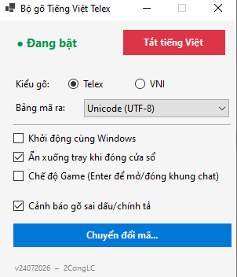

# 2CongLC-IME

<p align="center">
  
</p>

Bộ gõ tiếng Việt cho Windows, chạy nền (system tray), gõ được ở **mọi ứng dụng**
kể cả game — không cần cài driver. Build ra bản tự chứa (self-contained) nên
người dùng cuối cũng không cần cài .NET runtime riêng.

## Tính năng

- **2 kiểu gõ**: Telex và VNI.
- **3 bảng mã đầu ra**: Unicode (mặc định), TCVN3 (ABC/ABC+), VNI Windows (CP1258)
  — dùng được với các phần mềm cũ chỉ hỗ trợ font dấu kiểu cũ.
- **Công cụ chuyển đổi mã**: dán văn bản TCVN3/VNI cũ, chuyển sang Unicode hoặc
  ngược lại, kể cả từ Clipboard qua menu tray.
- **Chế độ Game**: khi bật, các phím dấu (s/f/r/x/j/z...) chỉ được IME xử lý lúc
  khung chat đang mở (bật/tắt bằng Enter) — còn lại nhả nguyên cho game dùng làm
  hotkey, không bị nuốt phím.
- **Cảnh báo gõ sai dấu/chính tả**: kiểm tra từng âm tiết vừa gõ xong với từ điển
  âm tiết tiếng Việt nhúng sẵn trong exe, hiện popup nhỏ gần vị trí con trỏ nhập
  liệu nếu phát hiện sai — không tự sửa, không cướp focus khỏi cửa sổ đang gõ.
- **Gợi ý theo ngữ cảnh (ONNX)**: khi âm tiết vừa gõ hợp lệ trong từ điển nhưng
  có thể bị nhầm với 1 từ khác cùng nghĩa gần giống (VD "chia sẻ" ↔ "chia sẽ",
  "sửa" ↔ "sữa"), 1 model ngôn ngữ nhỏ (ONNX) so sánh xác suất theo 2 từ ngữ
  cảnh trước đó và gợi ý nếu thấy chênh lệch rõ rệt. Đây là loại lỗi mà từ điển
  đơn thuần không bắt được vì cả 2 từ đều có nghĩa.
- **Chạy 1 instance**: mở lại app khi đã chạy sẵn sẽ chỉ đánh thức cửa sổ cũ.
- Tuỳ chọn khởi động cùng Windows, ẩn xuống tray.

## Kiến trúc

IME hoạt động bằng cách hook bàn phím ở mức toàn hệ thống (`WH_KEYBOARD_LL`),
tự ráp dấu tiếng Việt trong buffer nội bộ, rồi gửi ký tự đã ráp dấu ra ứng dụng
đang focus bằng `SendInput` (`KEYEVENTF_UNICODE`) hoặc `PostMessage` (`WM_CHAR`)
tuỳ bảng mã đầu ra. Vì hook chạy độc lập với thread của ứng dụng đích, IME không
đọc được nội dung ô nhập của app đó — nó chỉ biết những gì chính nó đã gõ ra,
lưu trong buffer riêng (`_buf`).

## Cấu trúc thư mục

```
2CongLC-IME-main/
├── build-singlefile.bat          ← build ra 1 file .exe duy nhất (self-contained)
├── build-framework-dependent.bat ← build gọn, cần cài .NET 9 Desktop Runtime để chạy
├── src/                          ← mã nguồn + project (.NET 9 SDK-style)
│   ├── VietnameseIME.vbproj         Project file — khai báo target, package
│   │                                ONNX Runtime, và file nào copy/nhúng
│   ├── VietnameseIME_WinForms.vb    Form chính, ráp dấu Telex/VNI, chuyển mã,
│   │                                cảnh báo chính tả, tray icon
│   ├── GlobalHook.vb                Wrapper WH_KEYBOARD_LL / WH_MOUSE_LL
│   ├── OnnxContextChecker.vb        Gọi model ONNX ngữ cảnh + sinh ứng viên
│   │                                dễ nhầm (s/x, tr/ch, d/gi/r, l/n)
│   ├── vietnamese_syllables.txt     Từ điển 7.244 âm tiết (nhúng vào exe)
│   ├── vn_context_lm.onnx           Model ONNX ngữ cảnh đã train (copy ra output)
│   └── vn_vocab.txt                 Vocab tương ứng với model (copy ra output)
├── bin/                          ← nơi 2 script trên xuất kết quả cuối cùng
└── colab/                        ← để train tiếp model ONNX
    ├── train_colab.ipynb             Sổ tay Colab train tiếp (warm-start)
    ├── vocab.json                    Vocab dạng JSON (dùng trong Colab)
    └── nplm.pt                       Checkpoint PyTorch để train tiếp
```

Lúc build, `dotnet` sẽ **luôn tự tạo thêm** `src\bin\` và `src\obj\` — đây là
thư mục tạm/trung gian mặc định của mọi project .NET, không phải kết quả cuối
(2 script tự xoá chúng sau khi build xong). Kết quả thật để chạy nằm ở `bin\`
ngoài cùng.

## Build

Yêu cầu cài **.NET 9 SDK** để build (khác với bản trước chỉ cần .NET Framework
có sẵn trên Windows) — tải tại https://dotnet.microsoft.com/download/dotnet/9.0.

Có **2 cách**, chọn 1 tuỳ nhu cầu — cả 2 đều xuất `VietnameseIME.exe` vào `bin\`:

**`build-singlefile.bat`** — build ra **đúng 1 file `.exe`** (đã nén sẵn .NET
runtime bên trong), máy chạy IME **không cần cài gì thêm** — giữ đúng tinh
thần "gọn nhẹ, không phụ thuộc" của bản gốc dùng `vbc.exe`. Đánh đổi: file to
hơn (runtime nhúng sẵn), và vẫn có 1 file `onnxruntime.dll` nằm rời bên cạnh
(native runtime của ONNX, không nhét vào file gộp được).

**`build-framework-dependent.bat`** — thư mục output gọn (chỉ vài file: exe +
DLL của project + DLL ONNX), nhưng **máy chạy IME phải tự cài trước** [.NET 9
Desktop Runtime](https://dotnet.microsoft.com/download/dotnet/9.0) (bản nhẹ
hơn SDK, chỉ để chạy chứ không build được). Hợp nếu bạn sẽ cài sẵn runtime
trên các máy định dùng, hoặc muốn thư mục build gọn để kiểm tra nhanh.

Cả 2 script đều:
- Tự tải `Microsoft.ML.OnnxRuntime` qua NuGet (managed + native DLL) — không
  còn cần `setup_onnx.bat`, không còn cần tự săn `netstandard.dll` hay dò
  thư mục `lib\`/`runtimes\` thủ công như bản build bằng `vbc.exe` trước đây.
- Nhúng `vietnamese_syllables.txt` vào exe làm resource, copy
  `vn_context_lm.onnx` + `vn_vocab.txt` ra `bin\` cùng exe.
- Tự dọn `src\bin\`/`src\obj\` sau khi build xong.

Lần build đầu có thể mất vài phút (dotnet tải NuGet packages về cache); các
lần sau nhanh hơn nhiều.

## Giới hạn cần biết

- **.NET 9 hết hỗ trợ 10/11/2026** (chỉ còn STS — Standard Term Support 24
  tháng, không phải LTS). Dự án hiện nhắm `net9.0-windows`; nếu muốn dùng lâu
  dài không phải nâng cấp sớm, đổi 1 dòng `<TargetFramework>` trong
  `src/VietnameseIME.vbproj` thành `net10.0-windows` (LTS, hỗ trợ tới
  11/2028) — cần cài .NET 10 SDK tương ứng, code không cần sửa gì thêm.
- Vị trí popup cảnh báo chính tả dựa vào `GetCaretPos` của Windows qua kỹ thuật
  `AttachThreadInput` tạm thời — không phải app nào cũng expose caret chuẩn
  (game DirectX/OpenGL, một số app Electron/Chromium tự vẽ caret riêng), khi đó
  popup sẽ hiện gần vị trí con trỏ chuột thay vì đúng vị trí đang gõ.
- Từ điển chính tả là **âm tiết**, không phải từ ghép — vì IME ráp dấu theo
  từng khối gõ một, không có ngữ cảnh câu.
- Đây là hook toàn hệ thống nên một số phần mềm chống cheat trong game có thể
  coi là hành vi đáng ngờ; dùng trong game tự chịu rủi ro.
- Model ONNX ngữ cảnh hiện tại (`vn_context_lm.onnx`) đã train tiếp 15 epoch
  trên **toàn bộ** 13,3 triệu token corpus Wikipedia tiếng Việt (qua Colab).
  Độ chính xác top-1: 17,3% (bản đầu) → 20,8% (5 epoch) → **21,6%** (15 epoch)
  — loss gần như đi ngang ở epoch 12-14 (4,641 → 4,637 → 4,634), tức model đã
  **chạm giới hạn của kiến trúc này** (embed 48 chiều, hidden 128, chỉ nhìn 2
  từ ngữ cảnh trước) — train thêm epoch không cải thiện đáng kể nữa. Cải
  thiện rõ với "sửa"/"sữa"; vẫn sai với "con dao sắc" (đoán "xắc" cao hơn — do
  "xắc" phổ biến trong corpus với nghĩa khác ("túi xắc")). Muốn khá hơn thật
  sự cần đổi kiến trúc (ngữ cảnh dài hơn 2 từ, model lớn hơn), không phải
  train lâu hơn — xem `colab/train_colab.ipynb` nếu muốn thử.

## Tác giả

CongPhuongInfo@Gmail.com — dự án mã nguồn mở, thoải mái sửa theo nhu cầu riêng.

## Lịch sử phát triển

- **18/06/2026** — Thêm Chế độ Game: gõ được trong game mà không bị khoá/nuốt phím.
- **21/06/2026** — Thêm bảng mã TCVN3 và VNI, công cụ chuyển đổi qua lại giữa
  Unicode / TCVN3 / VNI.
- **24/07/2026** — Thêm tính năng cảnh báo gõ sai dấu/chính tả theo thời gian
  thực, dùng từ điển 7.244 âm tiết nhúng sẵn trong exe.
- **25/07/2026** — Thêm tính năng gợi ý theo ngữ cảnh (model ONNX nhỏ, phát
  hiện nhầm âm/dấu kiểu "sửa"/"sữa" mà từ điển không bắt được). Train tiếp
  qua Colab (15 epoch, full dữ liệu) — độ chính xác top-1 21,6% (từ 17,3%);
  loss đi ngang ở epoch cuối, model đã chạm giới hạn kiến trúc hiện tại.
- **25/07/2026** — Tổ chức lại project thành `src/`, `bin/`, `colab/` cho dễ
  làm việc; cập nhật `buildexe.bat`/`setup_onnx.bat` dùng đường dẫn tương đối
  theo vị trí script (`%~dp0`) thay vì thư mục hiện hành.
- **25/07/2026** — Sửa lỗi build: struct `Win32.POINT` (thêm cho tính năng
  ONNX) trùng tên (không phân biệt hoa/thường trong VB.NET) với
  `System.Drawing.Point`, làm hỏng mọi `New Point(...)` trong toàn bộ form —
  đổi tên thành `Win32.POINTAPI`. `buildexe.bat` cũng dừng ngay với thông báo
  rõ ràng nếu thiếu `Microsoft.ML.OnnxRuntime.dll`, thay vì build lỗi dở dang.
- **25/07/2026** — Sửa `setup_onnx.bat`: từ bản gần đây, gói NuGet
  `Microsoft.ML.OnnxRuntime` chỉ còn native runtime, DLL quản lý (managed)
  đã tách sang gói riêng `Microsoft.ML.OnnxRuntime.Managed` — script giờ tải
  cả 2 gói.
- **25/07/2026** — Sửa thêm: `Microsoft.ML.OnnxRuntime.dll` (managed) target
  `netstandard2.0`, cần file facade `netstandard.dll` (gói NuGet
  `NETStandard.Library`) để `vbc.exe` build được — `setup_onnx.bat` giờ tải
  cả file này. Đồng thời bỏ cú pháp `?.` (null-conditional) trong
  `OnnxContextChecker.vb` vì `vbc.exe` trên máy build (VB2012 language level)
  không hỗ trợ.
- **25/07/2026** — Sửa lỗi cú pháp cmd.exe: dấu ngoặc đơn `(...)` trong text
  của `echo` nằm bên trong khối `if (...)` bị cmd.exe hiểu nhầm là ngoặc
  đóng khối ("... was unexpected at this time") — escape lại bằng `^(` `^)`
  trong cả `buildexe.bat` và `setup_onnx.bat`.
- **25/07/2026** — Chuyển toàn bộ build sang **.NET 9 SDK-style project**
  (`src/VietnameseIME.vbproj`, build bằng `dotnet publish` qua `bin/build.bat`
  duy nhất), bỏ hẳn `vbc.exe`/`buildexe.bat`/`setup_onnx.bat`. ONNX Runtime
  giờ chỉ cần khai báo `PackageReference` — hết mọi vướng mắc về
  `netstandard.dll`, gói NuGet tách managed/native, dò đường dẫn `lib\` thủ
  công. Build ra bản self-contained, người dùng cuối không cần cài .NET.
- **25/07/2026** — Tách build.bat thành 2 script đặt ở thư mục gốc:
  `build-singlefile.bat` (1 file .exe duy nhất, self-contained) và
  `build-framework-dependent.bat` (thư mục gọn, cần cài .NET 9 Desktop
  Runtime để chạy). Sửa lỗi XML comment chứa `--` (không hợp lệ trong XML)
  gây lỗi parse `.vbproj`.
